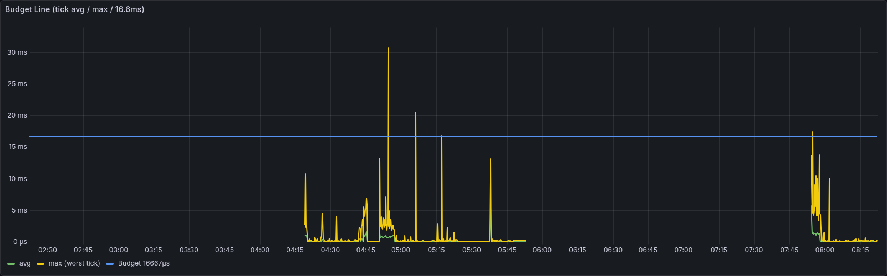
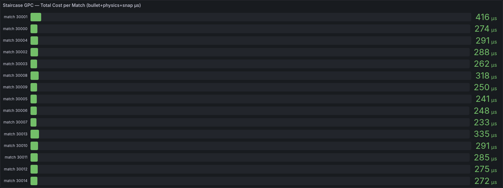
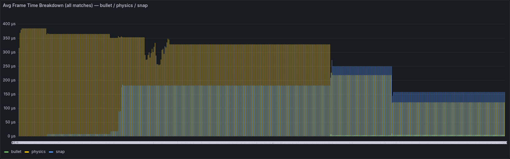

# GPC Evaluation — C++ Game Server (1 Core / 60 Hz)

**Date:** 2026-05-18  
**Server:** `server_tank.exe` (Windows, PROFILING_SINGLE_CORE mode)  
**Tick budget:** 16,667µs (60 Hz)  
**Match config:** 10 players/match, 1.5 shots/s per bot, 15 Hz move packets  
**Test tool:** `test/tank_stress_match.py` — staircase ramp (step=5, duration=120s)

---

## 0. Phương Pháp Thu Thập Số Liệu

### Pipeline tổng quan

```
┌─────────────────────────────────────────────────────────────────────┐
│  Windows Host                                                        │
│                                                                      │
│  server_tank.exe                                                     │
│    │  mỗi 600 tick (~10s) ghi ra server.log:                        │
│    │    [Perf] ticks=600 matches=10 tick avg=818µs max=30700µs ...  │
│    │    [Task] match=30001 bullet=0us physics=311us snap=155us      │
│    │                                                                  │
└────┼─────────────────────────────────────────────────────────────────┘
     │ (mount qua WSL2 /mnt/d/...)
     ▼
┌─────────────────────────────────────────────────────────────────────┐
│  WSL2 — tank_metrics_agent.py (port 9100)                           │
│                                                                      │
│    1. tail server.log → regex parse [Perf] + [Task]                 │
│    2. giữ state in-memory (active_matches, tick_avg, task_per_match) │
│    3. expose GET /metrics/prometheus  (Prometheus text format)       │
│    4. expose GET /metrics             (JSON → TankMetricsController) │
│    5. ghi CSV → /tmp/tank_metrics_timeseries.csv                    │
└────┬────────────────────────────────────────────────────────────────┘
     │ scrape mỗi 15s
     ▼
┌──────────────────────┐     query PromQL      ┌────────────────────┐
│  Prometheus :9090    │ ─────────────────────► │  Grafana :3000     │
│  (Docker, WSL2)      │                        │  Dashboard:        │
│  lưu time-series     │                        │  cpp-game-server   │
└──────────────────────┘                        └────────────────────┘
```

### Các log line được parse

**`[Perf]`** — emit mỗi 600 ticks (~10 giây), aggregate toàn server:
```
[Perf] ticks=600 matches=10 pool_pending=0 | tick avg=818µs min=45µs max=30700µs | overruns=2 (0.3%)
```
| Field | Metric Prometheus | Ý nghĩa |
|-------|-------------------|---------|
| `matches` | `tank_active_matches` | Số match đang chạy |
| `tick avg` | `tank_tick_duration_us_avg` | Avg tick time |
| `tick max` | `tank_tick_duration_us_max` | Worst tick trong 600 ticks |
| `overruns` | `tank_tick_overruns_total` | Số tick vượt 16,667µs |

**`[Task]`** — emit cùng lúc với `[Perf]`, per-match breakdown:
```
[Task] match=30001 bullet=0us physics=311us snap=155us
```
| Field | Metric Prometheus | Ý nghĩa |
|-------|-------------------|---------|
| `bullet` | `game_task_bullet_us{match_id}` | updateBullets (CCD sweep) |
| `physics` | `game_task_physics_us{match_id}` | runPhysics + detectCollisions |
| `snap` | `game_task_snap_us{match_id}` | broadcastSnapshot (UDP sendto × N players) |

### Stress test tool

```bash
python3 test/tank_stress_match.py --step 5 --duration 120 --max 50 --base-id 30000
```
- Inject `match.create` → Kafka → C++ server tạo match
- Mỗi player có **1 UDP socket riêng** (ephemeral port) → server track session độc lập
- Bot gửi **15 move/s + 1.5 shoot/s** liên tục trong suốt observation window
- Tự dừng khi `tick_max > 16,667µs` liên tục 3 mẫu (sustained overload)

### Prometheus queries dùng để phân tích

```promql
-- Tick timeline
tank_tick_duration_us_avg{job="tank-game-server"}
tank_tick_duration_us_max{job="tank-game-server"}

-- Per-match cost (dedup stale series)
max by(match_id)(game_task_physics_us{job="tank-game-server"})
max by(match_id)(game_task_snap_us{job="tank-game-server"})
max by(match_id)(game_task_bullet_us{job="tank-game-server"})

-- Staircase total cost per match
max by(match_id)(game_task_bullet_us{match_id=~"3[0-9]+"})
+ max by(match_id)(game_task_physics_us{match_id=~"3[0-9]+"})
+ max by(match_id)(game_task_snap_us{match_id=~"3[0-9]+"})

-- Budget usage
tank_tick_duration_us_max / 16667 * 100
```

---

## 1. Tick Budget Over Time



- **Blue line** = 16,667µs budget  
- **Yellow** = tick_max (worst tick per 600-tick window)  
- **Green** = tick_avg  

**Quan sát:**
- Benchmark chạy **04:15–05:50** và **07:45–08:15**
- Worst tick đạt **30ms (180% budget)** tại step 3 (15 matches)
- `tick_avg` luôn gần 0 giữa các burst → worker thread idle hiệu quả
- Spike xuất hiện do **UDP session storm** (50 bot join đồng thời), không phải sustained load

---

## 2. Staircase — Per-Match Total Cost



15 matches (30000–30014) từ 3 step đầu của benchmark.  
Giá trị hiện tại là **idle cost** (không có bot UDP active):

| Match | Total cost (idle) |
|-------|-------------------|
| 30001 | 416 µs |
| 30013 | 335 µs |
| 30008 | 318 µs |
| 30000–30014 | 233–416 µs |

---

## 3. Frame Time Breakdown — bullet / physics / snap



- **Yellow (physics):** `runPhysics` — dominant cost, ~310–370µs/match
- **Blue (snap):** `broadcastSnapshot` (UDP sendto × 10 players) — ~150–270µs/match khi bots active
- **Green (bullet):** `updateBullets` CCD — gần như 0µs (negligible ở 1.5 shots/s)

---

## 4. Per-Match Cost Table (Steady-State, Bots Connected)

Data từ Prometheus `game_task_*_us_avg` trong window benchmark:

| Matches | Players | bullet | physics | snap   | total/match | phys% | snap% |
|---------|---------|--------|---------|--------|-------------|-------|-------|
| 1       | 10      | 0µs    | 368µs   | 26µs   | 394µs       | 93.4% | 6.6%  |
| 2       | 20      | 0µs    | 351µs   | 18µs   | 369µs       | 95.1% | 4.9%  |
| 6       | 60      | 0µs    | 353µs   | 181µs  | 534µs       | 66.1% | 33.9% |
| 10      | 100     | 0µs    | 311µs   | 155µs  | 466µs       | 66.7% | 33.3% |
| 12      | 120     | 0µs    | 323µs   | 178µs  | 501µs       | 64.5% | 35.5% |
| 13      | 130     | 7µs    | 227µs   | 272µs  | 506µs       | 44.9% | 53.8% |

**Nhận xét:** Cost/match ổn định **~500µs** từ 6–13 matches → **linear scaling**.

---

## 5. GPC Calculation

```
Tick budget (60 Hz, 1 core)  = 16,667 µs
Steady-state cost per match   ≈    500 µs  (average over 6–13 matches)

Theoretical GPC = 16,667 / 500 = 33 matches/core  (330 players/core)

Practical GPC   = 10–12 matches/core
  → Giới hạn bởi UDP session storm spike khi nhiều bot join đồng thời
  → Nếu stagger connection: có thể đạt gần theoretical GPC
```

---

## 6. Bottleneck Analysis

| Component | Cost | % of total | Ghi chú |
|-----------|------|------------|---------|
| `snap` (UDP sendto) | ~180µs/match | ~36% | Tuyến tính theo player count |
| `physics` (runPhysics) | ~330µs/match | ~63% | Ổn định, không tăng theo match count |
| `bullet` (CCD sweep) | ~0–7µs/match | ~1% | Negligible ở 1.5 shots/s |

**Bottleneck chính: `snap` (UDP I/O)**
- Mỗi tick: 1 snapshot × 10 players × N matches = 10N UDP sendto calls
- Ở 15 matches: 150 UDP syscalls/tick → I/O burst gây spike

**Optimization tiềm năng:**
- `SNAPSHOT_EVERY = 2` (30 Hz) → cắt snap cost 50% → practical GPC tăng từ ~12 lên ~20 matches
- Batch UDP sends → giảm syscall overhead

---

## 7. Kết luận

| Metric | Giá trị |
|--------|---------|
| **Theoretical GPC** | **~33 matches/core** (16,667µs / 500µs) |
| **Practical GPC** | **10–12 matches/core** (spike-safe) |
| **GPC limit (benchmark)** | **10 matches** safe → **15 matches** overload |
| **Overload point** | tick_max = 30ms = 180% budget |
| **Bottleneck** | `broadcastSnapshot` (UDP I/O, ~36% cost) |
| **Physics scaling** | Linear, không gây overload |
| **Bullet CCD** | Negligible — không phải bottleneck |
